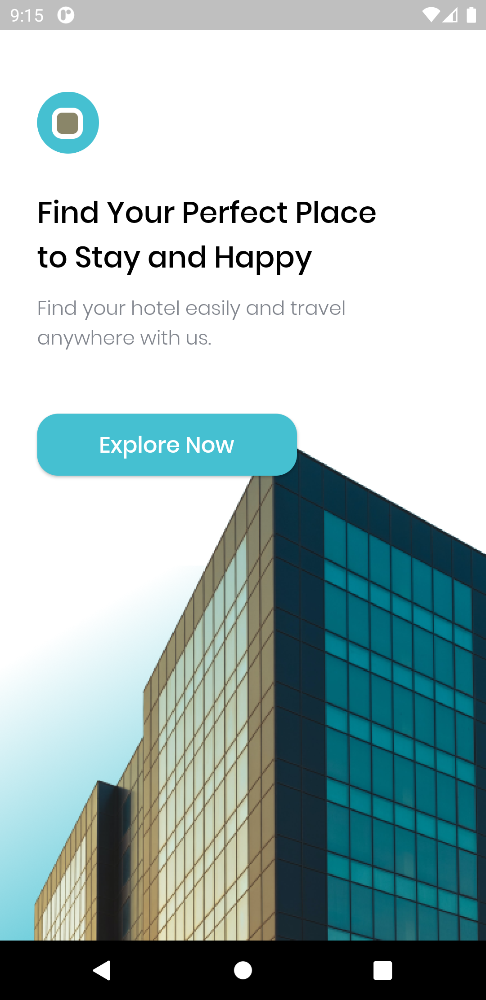
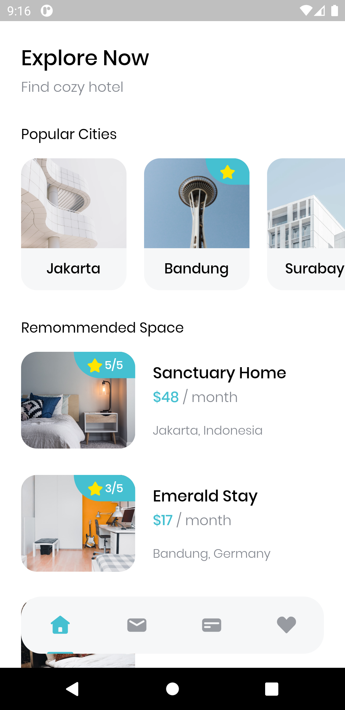
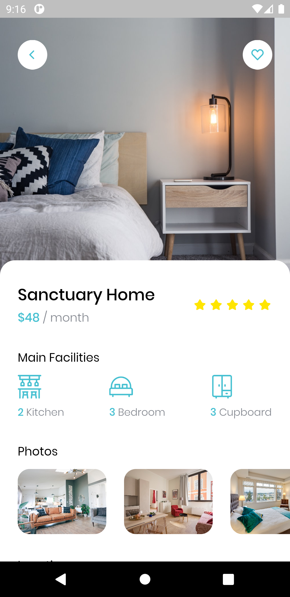
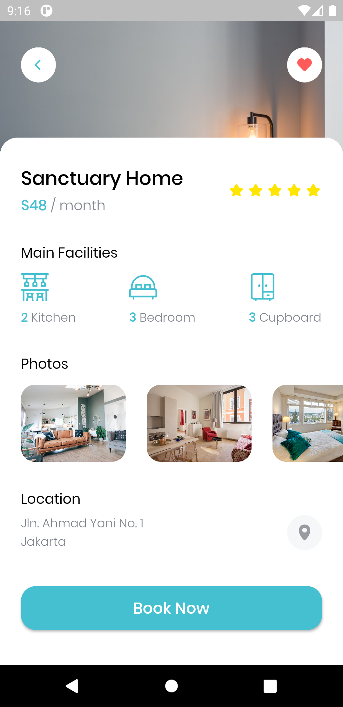

# Flutter Hotel App

Building a Hotel App UI in Flutter.

## Key Points

* Slicing Figma Design to Flutter
* Deploy to Firebase App Distribution (For Testing)
* State Management (Provider)
* Consume API

## Getting Started

For help getting started with Flutter, view Flutter online [documentation](https://flutter.dev/docs/get-started/install).

## Screenshots

<kbd></kbd>
<kbd></kbd>
<kbd></kbd>
<kbd></kbd>

> Made in ❤️ with Flutter.
